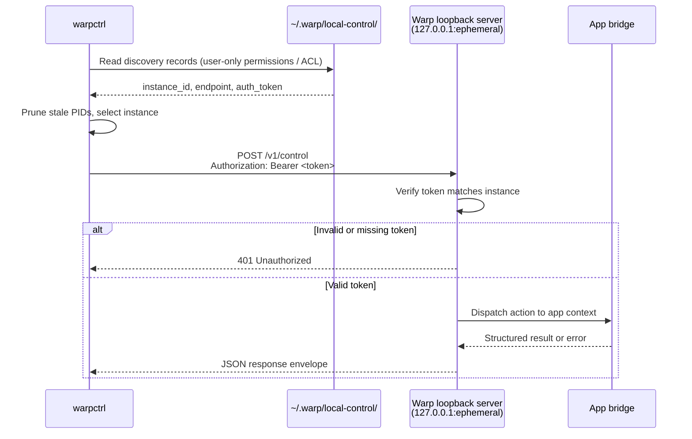

# warpctrl operator README
`warpctrl` is the provisional standalone CLI for controlling an already-running local Warp app instance. It is intended for scripts, demos, agent workflows, and developer automation that need to perform allowlisted Warp UI actions without launching the GUI executable in CLI mode.
The first implementation slice is intentionally narrow:
- discover compatible running Warp instances;
- select one instance implicitly when unambiguous or explicitly with `--instance`;
- send authenticated local-control requests through the per-instance discovery record;
- create a new terminal tab with `warpctrl tab create`.
The local-control protocol and catalog are broader than this slice, but commands outside the implemented capability set should fail with structured unsupported-action errors until their handlers land.
## Packaging model
`warpctrl` should be packaged as a separate CLI artifact from the Warp GUI app while reusing shared repository code:
- `crates/local_control` owns discovery records, local authentication material, client transport, protocol envelopes, action names, and error types.
- `crates/warp_cli` owns command parsing conventions for local-control subcommands.
- the app-side bridge owns the per-process loopback listener and dispatches supported actions onto the live Warp UI context.
The binary should initialize only CLI parsing, instance discovery, local authentication loading, request serialization, HTTP transport, and output formatting. It should not initialize GUI state, terminal models, rendering, workspaces, or main-app startup paths.
During the provisional naming period, release artifacts and helper names may be channelized, but operator docs and examples should use `warpctrl` unless an integration branch explicitly documents a channel-specific alias.
This branch wires the standalone binary target and the macOS/Linux bundle-script artifact selectors:
- `cargo build -p warp --bin warpctrl`
- `script/macos/bundle --artifact warpctrl ...`
- `script/linux/bundle --artifact warpctrl ...`
Windows has the native Rust binary target, but installer/release helper exposure remains follow-up packaging work.
## Install and invocation guidance
### macOS
Build locally with `cargo build -p warp --bin warpctrl`, then run `target/debug/warpctrl` or copy/symlink that binary onto `PATH`.
For distributable standalone artifact checks, use `script/macos/bundle --artifact warpctrl` with the desired channel/signing flags. The bundle script writes a standalone `warpctrl` binary into its macOS artifact output directory instead of embedding it in the GUI app bundle.
### Linux
Build locally with `cargo build -p warp --bin warpctrl`, then run `target/debug/warpctrl` or copy/symlink that binary onto `PATH`.
For distributable standalone artifact checks, use `script/linux/bundle --artifact warpctrl` with the desired channel/package selection. The Linux bundle script routes packaging through the standalone control-binary artifact path; downstream package installation should place the emitted `warpctrl` binary according to that package format.
Run `warpctrl --version` after installation to confirm the shell is resolving the expected build.
### Windows
Build locally with `cargo build -p warp --bin warpctrl`, then run `target\debug\warpctrl.exe` or copy that binary onto `PATH`.
The Windows-native binary target exists in this slice. Installer helper creation and release-artifact wiring still need a later packaging change before docs can promise an installer-provided `warpctrl` command.
## End-to-end local test flow
Use matching app and CLI bits from the same branch or release artifact so the protocol version, parser, and action catalog agree.
1. Start Warp and leave at least one window open.
2. Confirm that the local-control server registered the running process:
   ```bash
   warpctrl instance list
   ```
3. If exactly one compatible instance is listed, create a new terminal tab:
   ```bash
   warpctrl tab create
   ```
4. If multiple compatible instances are listed, copy the desired `instance_id` and target it explicitly:
   ```bash
   warpctrl tab create --instance <instance_id>
   ```
5. Verify the running app receives focus for the selected instance and a new terminal tab appears according to Warp's normal new-tab placement behavior.
6. Inspect the structured output with `--output-format json` when wiring scripts or agent workflows.
Expected failures:
- no running compatible app: exits non-zero with a no-instance error;
- multiple ambiguous instances: exits non-zero and asks for `--instance`;
- unsupported app build or stale discovery record: exits non-zero with a protocol, stale-target, or transport error;
- `tab.create` not yet implemented by the running app bridge: exits non-zero with an unsupported-action error.
## Command reference status
The current foundation branch exposes only the first end-to-end command slice in the public parser. Broader product commands may appear in `PRODUCT.md` as approved planned scope, and some protocol variants already exist as catalog stubs, but operator docs and agent skills must not imply those commands are usable until the selected app advertises them as implemented.
### Implemented parser commands
- `warpctrl instance list` — action: `instance.list`, status: implemented, category: metadata read, permission: read metadata, authenticated Warp user: no, invocation context: outside Warp.
- `warpctrl app ping [--instance <id>|--pid <pid>]` — action: `app.ping`, status: implemented, category: metadata read, permission: read metadata, authenticated Warp user: no, invocation context: outside Warp.
- `warpctrl app version [--instance <id>|--pid <pid>]` — action: `app.version`, status: implemented, category: metadata read, permission: read metadata, authenticated Warp user: no, invocation context: outside Warp.
- `warpctrl tab create [--instance <id>|--pid <pid>]` — action: `tab.create`, status: implemented, category: app-state mutation, permission: mutate app state, authenticated Warp user: no, invocation context: outside Warp.
- `warpctrl completions [bash|zsh|fish|powershell|elvish]` — local CLI helper only; it generates shell completions and does not call the local-control protocol.
### Catalog stubs in this branch
The protocol catalog currently reserves these action names but marks them as stubs. They are not accepted by the public parser in this branch unless a higher shard adds the parser and bridge handler:
- `app.inspect`, status: stub.
- `app.active`, status: stub.
- `app.focus`, status: stub.
- `app.settings.open`, status: stub.
- `app.command_palette.open`, status: stub.
- `app.command_search.open`, status: stub.
- `app.warp_drive.open`, status: stub.
- `app.warp_drive.toggle`, status: stub.
- `app.resource_center.toggle`, status: stub.
- `app.ai_assistant.toggle`, status: stub.
- `app.code_review.toggle`, status: stub.
- `app.vertical_tabs.toggle`, status: stub.
- `window.list`, status: stub.
- `window.create`, status: stub.
- `window.focus`, status: stub.
- `window.close`, status: stub.
- `tab.list`, status: stub.
- `tab.activate`, status: stub.
- `tab.move`, status: stub.
- `tab.rename`, status: stub.
- `tab.close`, status: stub.
- `pane.list`, status: stub.
- `pane.split`, status: stub.
- `pane.focus`, status: stub.
- `pane.navigate`, status: stub.
- `pane.close`, status: stub.
- `pane.maximize`, status: stub.
- `pane.resize`, status: stub.
- `pane.session.previous`, status: stub.
- `pane.session.next`, status: stub.
- `session.list`, status: stub.
- `input.insert`, status: stub.
- `input.replace`, status: stub.
- `input.clear`, status: stub.
- `input.mode.set`, status: stub.
- `theme.list`, status: stub.
- `theme.set`, status: stub.
- `appearance.get`, status: stub.
- `appearance.set`, status: stub.
- `appearance.font_size`, status: stub.
- `appearance.zoom`, status: stub.
- `setting.get`, status: stub.
- `setting.list`, status: stub.
- `setting.set`, status: stub.
- `setting.toggle`, status: stub.
### Approved planned product entries not yet in this branch's runtime catalog
These commands are part of the approved product direction in `PRODUCT.md`, but the foundation runtime catalog does not advertise them yet. Docs, skills, and examples should describe them as planned until the corresponding shard adds parser support, catalog metadata, permission tests, and bridge handlers:
- Read-only structural inspection: `instance inspect`, `app active`, `capability list`, `capability inspect`, `window inspect`, `tab inspect`, `pane inspect`, and `session inspect`.
- Underlying-data reads: `block list`, `block inspect`, `block output`, `input get`, and `history list`.
- Additional metadata reads: `theme get`, `setting list`, `setting get`, `keybinding list`, `keybinding get`, `action list`, and `action inspect`.
- App-state file and project intents: `file open`, `file list`, `project active`, `project list`, and `project open`.
- Warp Drive reads and app-state opens: `drive list`, `drive inspect`, `drive open`, `drive notebook open`, `drive env-var-collection open`, and `drive object share open`.
- Authenticated Warp Drive mutations: `drive object create`, `drive object update`, `drive object delete`, `drive object insert`, `drive object share-to-team`, and `drive workflow run`.
- Auth setup and inspection: `auth status`, `auth login`, `auth api-key set`, `auth api-key status`, and `auth api-key revoke`.
- Execution-underlying command submission: `input run`.
### Explicit exclusions
`warpctrl` operates Warp product surfaces, not arbitrary local filesystems or internal dispatch tables. The public catalog must not include local file content reads, local file content writes, local file appends, local file deletes, accepted-command submission, agent-prompt submission, arbitrary internal action dispatch, arbitrary ACL editing, external sharing, or public-link creation.
File/path support is limited to app-state and metadata behavior:
- `file open <path>` opens a file in Warp's visible editor surface.
- `file list` lists files currently open in Warp editor state.
- `project open`, `project list`, and `project active` operate Warp project/workspace state.
Use native file tools, shell commands, or editor integrations for filesystem content reads, writes, appends, and deletes.
Warp Drive sharing v0 has two distinct paths:
- `drive object share open <id>` is an app-state mutation that opens the share dialog for user review and does not change sharing state.
- `drive object share-to-team <id>` is the only direct native sharing mutation in the v0 product scope. It makes a personal object available to the current user's team through Warp's standard team-sharing behavior and requires authenticated-user plus underlying-data-mutation authority.
Sharing with named users, external guests, arbitrary ACL edits, and public links remain excluded until separately reviewed.
## Security model
The local-control protocol is designed for same-user scripting, not cross-user or network access. The trust boundary is the local user account.
- **Loopback-only listener.** Each Warp process binds its control server to `127.0.0.1` on an ephemeral port. The listener is not reachable from the network.
- **Per-instance bearer token.** A random token is generated at startup and written into the discovery record. Every control request must present this token in the `Authorization` header; missing or invalid tokens are rejected with HTTP 401.
- **File-permission-gated discovery.** Discovery records are stored in a per-user local-control directory. On POSIX platforms, files must be created with `0600` permissions (owner read/write only). On Windows, records must be stored under the current user's app data directory with an ACL that grants access only to the current user, Administrators, and SYSTEM. Any same-user process that can read the credential can authenticate, so the baseline security boundary is same-user process isolation.
- **Stale-record pruning.** On each `instance list` or implicit discovery call, records whose PID is no longer alive are deleted automatically, preventing stale tokens from lingering on disk.
- **No CORS.** The control endpoints do not set permissive CORS headers, so browser-origin JavaScript cannot read responses even if it guesses the port. The bearer token requirement provides a second layer since browsers cannot read the discovery file.

**Known limitations and future hardening:**
- The token is stored in plaintext in the discovery JSON file. Any compromised process running as the same user can extract it.
- Tokens do not rotate or expire during a Warp session. A leaked token is valid until the process exits.
- Windows local-control authentication is not complete until discovery-record ACL creation and validation are implemented.
- Once higher-risk handlers land (e.g. `input.insert`, command execution), the same-user boundary becomes a code-execution trust boundary. Consider separating the token from the discovery metadata, adding per-request nonces, or switching to a Unix domain socket with `SO_PEERCRED` for kernel-verified caller identity.
## Documentation review notes
- Treat `warpctrl` as provisional executable naming until packaging signs off on final artifact aliases.
- Keep examples scoped to discovery and `tab create` until additional app-side handlers are implemented.
- Do not document catalog commands as usable just because they exist in protocol enums or parser scaffolding; operator docs should distinguish implemented commands from planned allowlist entries.
- Windows packaging may initially follow the existing helper-wrapper pattern rather than shipping a native standalone executable. Update this README when that decision is final.
